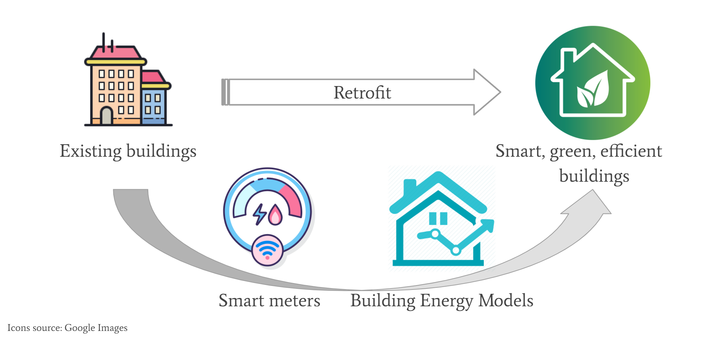

## Introduction

By utilizing modern electric meters, it possible to collect and store enormous amount of data about building energy consumption. This data can be used to predict
energy consumption and help energy providers manage energy (electricity) output and plan for energy peaks/lows. It can also help the indiviudal resident keep track
of their energy usage and perhaps even recommend energy saving actions. 

As the human population increases, it is vital to lower the energy footprint of each individual and conserve the limited resources earth has to offer to future generations.
Household energy consumption is a big part of our total energy consumption, and new technology offers new ways of decreasing it.

This project focuses on predicting building energy consumption based on the Kaggle competition "ASHRAE - Great Energy Predictor III". The main goal of the project is first and foremost to create an AI-model that can predict the energy usage of a building as accurately as possible, based on different input data such as air temperature, building size etc. In addition to that, different AI-models are explored to investigate which one works the best for this particular competition.

{#fig:image1}
