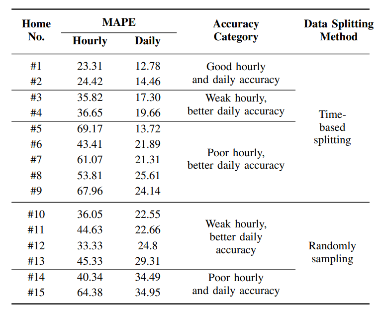

## Literature review
### Zhang, Grolinger, & Capretz (2019): Forecasting Residential Energy Consumption: Single Household Perspective
In the paper “Forecasting Residential Energy Consumption: Single Household Perspective” [@zhang2019], the authors attempt to predict energy consumption in residential households, with focus on single households. 

According to the authors it is more difficult to predict single household energy (electricity) consumption, compared with e.g. workplace energy consumption. The reason is that single households often differ in energy consumption patterns while workplace patters tend to be more similar. Also, if big workplace buildings or multi-family residential buildings are analysed, any anomalies tend to cancel each other out (with a big enough dataset).

#### Data set
The data set used originates from an electricity provider in London, Ontario, Canada. It consists of hourly smart-meter readings of electricity usage (kWh) of 15 households between 2014 and 2016. 

Firstly, the data set used might not be sufficiently broad. Tracking only 15 households will most likely not capture a variety of electricity consumption patterns. However, it was deemed enough in this case. Furthermore, the data set comes from one city with a certain climate, which means that different environmental prerequisites are not considered. Perhaps using other cities from a different part of the world would lay a foundation for a more advanced ML-algorithm (Machine Learning algorithm). As it is now, the ML-algorithm might be inaccurate for other parts of the world.   In addition to this, Zhang, Grolinger & Capretz  state that residents of London, Ontario, Canada tend to heat their homes gas heating systems, which affects the electricity consumption drastically. 

Secondly, the data set used is pre-processed in different ways. Any missing readings of electricity consumption is replaced with the average value of the previous reading and the next reading, missing weather condition is replaced with the weather condition of the previous hour etc. This is perfectly good way of replacing missing data. However, the authors do not give an explanation as to why this method was chosen, if there are any consequences and if there are other methods of making the data set complete. 

#### Exploratory Data Analysis
The EDA performed by the authors is illustrated in the form of electricity consumption graphs and heat-maps. The patterns show that most households live regular lives (the authors do not define what “regular lives” mean, though it can be understood by the context). However, there are some exceptions where irregularities occur (e.g. empty homes during the summer when consumption otherwise is the highest), which significantly reduce the precision. This could be improved by adding vacancy detection which could be implemented in the ML-algorithm (which raise privacy concerns).  Zhang, Grolinger & Capretz realize that the top three most important variables (i.e. the variables that correlate the most with the output energy consumption) are “temperature”, “hour of the day” and “peak index”. Peak index is a variable that captures important energy usage peaks, such as peak hours, days, seasons etc. 

#### Prediction model and results
The authors used Support Vector Regression (SVR) to predict the energy consumption. SVR is a supervised machine learning algorithm, which means that it is compares an input with an output and is trained by comparing predicted results with true results.  It was chosen due to time and computational hardware constraints. No other evaluations or comparison of other machine learning algorithms were made by the authors, so it is difficult to understand why SVM is faster and require less processing power. 
Zhang, Grolinger & Capretz present the results for home #1 in Figure {@fig:image1}. They managed to predict electricity consumption well. The most inaccurate parts are peaks that arise due to random variations. Furthermore, the authors present a table with results for all 15 homes, Figure {@fig:image2}. According to them, time-based splitting is used to check parameter stability over time, which makes the algorithm more accurate. In this case however random sampling performs better in cases where some residential customers have irregular and uncertain patterns. These uncertain patterns make time-based splitting more inaccurate over time. Therefore, both methods are employed. Lastly, mean absolute percentage of error (MAPE) was utilized to measure the performance of the algorithm, which is a widely used performance metric. 

{#fig:image1}

{#fig:image2}

#### Conclusion
The biggest strength of the paper is the execution of the chosen methods to achieve desired results. It is a relatively successful attempt at predicting single households, which tend to be more unpredictable compared to multi-family or corporate residential buildings. The biggest weakness is the justification for the chosen methods. The authors do an excellent job of utilizing the chosen methods, but there is little thought put in to why these methods where chosen or why they did certain things. By including a more extensive evaluation and justification for method choices, the target audience and other researchers in the same field can understand better and continue the research. However, it makes the paper longer and more complex, which can be negative for the readers and the target audience. 

### Edwards, New, & Parker (2012): Predicting future hourly residential electrical consumption: A machine learning case study
The article explores seven machine learning (ML) techniques on their performances in predicting next hour electricity consumption of buildings, with a focus on residential buildings. Sensor-based energy modeling uses high-frequency sensor data and ML algorithms to statistically derive building energy forecasting models that can help improve building efficiency. Previous studies have applied such models to commercial buildings where high-frequency sensor data are available, but not to residential buildings due to a lack of sensors in homes and consequently a lack of frequent sensor data. The authors address this gap by employing a new high-frequency residential dataset to test proven and emerging ML techniques on predicting next hour residential energy consumptions. The ML techniques used include: Linear Regression, Feed Forward Neural Networks (FFNN), Support Vector Regression (SVR), Least Squares Support Vector Machines (LS-SVM), Hierarchical Mixture of Experts (HME) with Linear Regression Experts, HME with FFNN Experts, and Fuzzy C-Means with FFNN. They use cross validation for parameter tuning, and select the best model based on three performance metrics, namely Coefficient of Variance (CV), Mean Bias Error (MBE) and Mean Absolute Percentage of Error (MAPE). 

The authors first validate the ML techniques on the ASHRAE Great Energy Predictor Shootout dataset, which contains hourly sensor data for a commercial building of year 1989. They find that FFNN performs best on this dataset, with CV at ~11%, competitive with the top-3 competition winners. Then they apply these techniques to the new dataset, the Campbell Creek dataset, which contains full-year (2010) measurements at 15-minute interval from sensors installed on three Tennessee homes. The results show unsatisfactory results from FFNN (CV = ~32%), close to the baseline Linear Regression (CV = ~34%). LS-SVM is selected as the overall best technique for modeling the Campbell houses, with an average CV of ~26%. The overall larger model errors in the residential dataset are attributed to variant occupancy behaviors in homes that lead to more complex energy use patterns, as compared to those of commercial buildings, which tend to vary only between workdays and weekends/holidays. The also find that statistically different training and testing data may cause LS-SVM to fail when generalizing to the testing data, which is the case for the ASHRAE dataset. The performance of LS-SVM is improved after randomizing the training and testing data. 

This paper provides a comprehensive analysis on the application of multiple ML techniques to building energy data, which could serve as a guide to our project. The discussions on the differences between commercial and residential buildings are particularly helpful for our feature engineering and model selection, as we are expected to model 16 building types, commercial and residential included. The authors are also able to identify and prove the cause of failure for LS-SVM on the ASHRAE dataset, which may help us in model tuning and selection. Despite these merits, the paper does not address the differences in performance for FFNN, HME-FFNN and FCM-FFNN, the three closely related methods, shedding doubts on whether it is necessary to include them all. In addition, it would be very informative if the paper included the computational expenses required for training each model, which could be an important metric in model selection especially for real-life applications.

### Ferrarini, L., Fathi, E., Disegna, S., & Rastegarpour, S. (2019). Energy consumption models for residential buildings: A case study.
This article mainly discusses the advantages and disadvantages of four different energy consumption models for residential buildings based on a real building in the north part of Italy. These four energy consumption models are Black-box and scenario definition model, Gray-box model, White-box (Energy Plus) model and Tuned Energy Plus model respectively.

Due to the fact that the energy consumption is affected by multiple kind of factors such as the building material, light, temperature and so on. Different data sources are needed in this analysis. Therefore, the data that this paper use to analyze is mainly from three different kind of sensors which are temperature sensor, heat cost allocator and heat meter respectively. What’s more, the meteorological data is also be considered in these models. The data was collected every 15 minutes and the whole collecting process lasted for seven months.

In the main body of this paper, it introduces the different modeling approaches of these four energy consumption models and use all of them to calculate the yearly and monthly energy consumption. After that, three important indexes are introduced to compare the four models which are error, error% and NRMSE% respectively. The index of error is used to evaluate the monthly consumption, while the indexes of error% and NRMSE% are used to evaluate the yearly consumption This paper subtracts measured energy consumption from the estimated energy consumption to ger error and it divides error by measured energy consumption to get error%. In addition, it calculates the NRMSE% with a complex mathematical formula with the value of error and error%.

According to the figure 1 shown in the article (2019), we can tell that the model of black-box 1 has the smallest error, which means it is the most accurate model among these models both on a monthly and annual basis. The reason for its accuracy is that it uses more direct measurement data in the modeling process, unlike other models that convert part of the measurement data into other parameters before using it.

In addition, although compared to Black-box model, the tuned Energy Plus model does not have that high accuracy rate, but its performance in the annual forecast fully meets industry requirements according to the Ferrarini's summary (2019).

In conclusion, at the end of the article, the author summarized the four models and affirmed the practicality of black-box and tuned Energy Plus model once again. 

### Amasyali, K., & El-Gohary, N. M. (2018). A review of data-driven building energy consumption prediction studies. 

Buildings cause a large portion of energy consumption across the world. To reduce the energy consumption, plenty of research has been conducted on predicting the energy consumption for different types of buildings. Two major approaches for predicting building energy consumption are: physical modeling (forward-modeling/white-box modeling) and data-driven modeling (black-box modeling). Physical models are based on detailed energy analysis which requires input information such as building geometry and construction materials. Since physical models rely heavily on the accurate input but the detailed input is often not available to the public, data-driven models based on the available energy consumption data has come to attention. The four typical steps in developing a data-driven model are: data collection, data preprocessing, model training and model testing.

This paper (Amasyali & EI-Gohary, 2017) provides a review of the existing data-driven building energy consumption models from a multivariate perspective. In this paper, the existing models are categorized based on the following criteria: 1. Scope of prediction. The scope of prediction is classified by types of building, temporal granularity, and type of energy consumption predicted. 2. Types of data. Data are classified into real data, simulated data and publicly available benchmark data such as ASHRAE’s Great Building Energy Predictor Shootout dataset. 3. Types of features used in the machine learning algorithms, such as building characteristics, occupant energy use behavior, and outdoor weather conditions. 4. Data sizes, which is related to the collection period of the energy consumption data. 5. Data preprocessing techniques such as data cleaning, data integration, data transformation and data reduction. 6. Machine learning algorithms. The widely used model training algorithms in this field includes: SVM, ANN, decision trees, and other statistical algorithms such as multiple linear regression, general linear regression, autoregressive integrated moving average, Bayesian regression, polynomial regression, etc. Each algorithm has its benefits and drawbacks and should be chosen based on the available data and the goal of the project. For example, statistical algorithms are usually easy to be understood and explained, while the model accuracy might be not as good as SVM and ANN models. 6.  Model performance evaluation. The widely used criteria for testing the model performance are the coefficient of variance, mean absolute percentage error, and root mean square error.

The limitations of the existing models are also summarized in this paper. First, data-driven models may perform poorly with new datasets. Thus, the usage of a data-driven model might be limited to certain data ranges. Second, since the data-driven models are black-box models, it is hard to interpret the physical meanings of the models to gain better understanding of buildings’ energy consumption. Thus, hybrid models which combine physical modeling and data-driven modeling can balance the benefits and drawbacks of both modeling approaches. 

After reading this paper, we can narrow down the possible models for the project based on the available data provided in Kaggle. Since the meter data is time series data, statistical models such as the autoregressive model or autoregressive integrated moving average might be preferred. 
