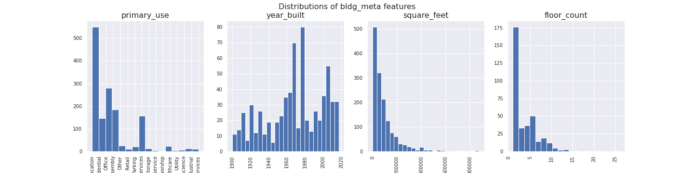

## Methods
### Exploratory Data Analysis
Five data files are provided in the competition dataset. The file names and the contents of each file are detailed below (adapted from the [competition site](https://www.kaggle.com/c/ashrae-energy-prediction/data)).

**train.csv**
* `building_id` - Foreign key for the building metadata.
* `meter` - The meter id code. Read as {0: electricity, 1: chilledwater, 2: steam, 3: hotwater}. Not every building has all meter types.
* `timestamp` - When the measurement was taken
* `meter_reading` - The target variable. Energy consumption in kWh (or equivalent, except site 0 electric meter readings which are in kBTU). Note that this is real data with measurement error, which may impose a baseline level of modeling error. 

**building_meta.csv**
* `site_id` - Foreign key for the weather files.
* `building_id` - Foreign key for training.csv
* `primary_use` - Indicator of the primary category of activities for the building based on EnergyStar property type definitions
* `square_feet` - Gross floor area of the building
* `year_built` - Year building was opened
* `floor_count` - Number of floors of the building

**weather_[train/test].csv** <br>
Weather data from a meteorological station as close as possible to the site.
* `site_id`
* `air_temperature` - Degrees Celsius
* `cloud_coverage` - Portion of the sky covered in clouds, in oktas
* `dew_temperature` - Degrees Celsius
* `precip_depth_1_hr` - Millimeters
* `sea_level_pressure` - Millibar/hectopascals
* `wind_direction` - Compass direction (0-360)
* `wind_speed` - Meters per second

**test.csv** <br>
The submission files use row numbers for ID codes in order to save space on the file uploads. test.csv has no feature data; it exists to help get predictions into the correct order.

* `row_id` - Row id for your submission file
* `building_id` - Building id code
* `meter` - The meter id code
* `timestamp` - Timestamps for the test data period

**sample_submission.csv** <br>
A valid sample submission containing `row_id` to match your predictions.

All floats in the solution file were truncated to four decimal places. There are gaps in some of the meter readings for both the train and test sets. Gaps in the test set are not revealed or scored.

#### Missing values
Here are the number (percentage) of missing values in each dataframes:
1. **Missing data in bldg_meta**: <br>
    * primary_use: 	0 (0.0%)<br>
    * year_built: 	774 (53.4%)<br>
    * square_feet: 	0 (0.0%)<br>
    * floor_count: 	1094 (75.5%) <br>
2. **Missing data in weather_train**:<br>
    * air_temperature: 	55 (0.0%)<br>
    * cloud_coverage: 	69173 (49.5%)<br>
    * dew_temperature: 	113 (0.1%)<br>
    * precip_depth_1_hr: 	50289 (36.0%)<br>
    * sea_level_pressure: 	10618 (7.6%)<br>
    * wind_direction: 	6268 (4.5%)<br>
    * wind_speed: 	304 (0.2%) <br>
3. **Missing data in weather_test**:<br>
    * air_temperature: 	104 (0.0%)<br>
    * cloud_coverage: 	140448 (50.7%)<br>
    * dew_temperature: 	327 (0.1%)<br>
    * precip_depth_1_hr: 	95588 (34.5%)<br>
    * sea_level_pressure: 	21265 (7.7%)<br>
    * wind_direction: 	12370 (4.5%)<br>
    * wind_speed: 	460 (0.2%)<br>

As we can see, some features such as `year_built`, `floor_count` and `air_temperature`, are missing over half of all entries. Special attention should be given to these variables when filling in the missing values to avoid losing raw training data while minimizing artificial influence.

#### Building Metadata
There are in total 16 sites, labeled 0~15 (`site_id`), containing 1449 buildings. Each building is identified with a unique `building_id` independent from the `site_id`, from 0 to 1448. The number of buildings in each site differ greatly, as shown in {@fig:image2}.

{#fig:image2}

There are 16 primary use types, with a mix of residential and commercial buildings, mostly built after the 1950s. Both the building square footage and floor counts are approximately logarithmically distributed, meaning most buildings are relatively small, single- to multi-story buildings ({@fig:image3}). There's a fairly strong correlation (correlation coefficient = 0.53) between building square footage and floor counts, as we could expect, and a small but positive correlation between the constructed year and the building size (0.11). 

{#fig:image3}

#### Target Variable: Meter Readings
ASSIGNED TO: Mingyu

#### Weather Data
`weather_train` has 2016 hourly weather data, and `weather_test` has 2017~18 hourly weather data. The time series plots for all variables of both the training and test periods are shown below ({@fig:image4}).

{#fig:image4}

#### Correlations
Putting `building_metadata`, `train` and `weather_train` together, we can generate the correlation between each features and the target variable. The heat map below ({@fig:image5}) shows that the correlation between variables range from -0.32 to 0.98, but no individual features have significant correlation with the target variable `meter_reading`. The top 5 most features most correlated with `meter_reading` are building square footage (0.13), number of floors (0.13), year of construction (0.11), meter type (0.077), and sites (0.047). This suggests that building metadata are potentially important predictors for our machine learning models, and the missing values need to be treated with care.

In addition, some features show rather strong correlations with each other, such as: `square_feet` and `floor_count` (0.58); `air_temperature` and `dew_temperature` (0.75); `wind_direction` and `wind_speed` (0.43). This may provide insights to imputation of the missing values.

{#fig:image5}

### Machine Learning Models
#### Baseline: Linear Regression
This section will cover how a linear regression model was constructed in order to predict household energy consumption, as well as discuss the limitations of a linear model. 

**Training data preprocessing**
As it has been described earlier in this section sections, the data used for this Kaggle competition came in three different files: train data, building metadata and weather train data. Since the dataset contains over 20 million readings and numerous features, issues with RAM usage had to be dealt with. The main problem was that not all desirable features could be included in the before RAM usage hit the limit. It was crucial to identify the most predictive features and not include meaningless features which would increase unneccesary RAM usage. In addition to that, a memory saving function was utilized, which changed the data types to be less memory demanding. Lastly, the three datasets were loaded with only the desired columns, to further reduce unneccesary RAM usage.

**Linear regression model**
The linear regression model was created by adding a feature layer with all the desired numerical and categorical features and then adding a dense layer for linear regression. First, missing values in a column were replaced with the mean of that column. In order to create a feature layer, the features used for the prediction had to be converted to tensors. Lastly, categorical features had to be one-hot encoded before being added to the feature layer.

The best public score (RMSLE) that could be obtained with this linear model was 4,5 (4,24 private score).

**Imporvements**
Is RMSLE of 4,5 the limit for linear regression? Most likely not. In the model and data preparation, several things can be made better. First, the datasets could be optimized even better. Site_id 13 was removed because the values were suspiciously high, as seen in the EDA. In this case, an even more in-depth "cleaning" could be made to locade the exact building_id (or several building_ids) that is responsible for the data anomaly. This deeper cleaning was made for the other models, but not for the linear regression model.Furthermore, if cateorical values could be implemented not only in the training, but also the prediction, perhaps a better score could be obtained. However, it must be realized that no matter how many parameters are added to a linear model, it will still only predict new values linearly. If many or strong non-linear relationships exist between the target variable and predition features, a linear model will never be able to perform nearly as good as e.g. neural networks.


#### Neural Network: Recurrent Neural Network with Long Short Term Memory (RNN-LSTM)
**Choossing the Model**<br>
This dataset is in its essense a time-series dataset, which is what RNN is designed at handling. LSTM is one of the most effective and commonly used RNN that improves on RNN's diminishing gradient problem. The advantage of using RNN-LSTM is that instead of using engineer features to account for the time information, the model architecture inherently carries this info and learns the relationship between each timestep, reducing the number of features needed. 

**Training Data Preprocessing**<br>
*Building Metadata*<br>
We first treated the building meta data as it is used in both training and testing. `year_built` and `floor_count` were the two features containing missing data. Since one site likely has buildings built around the same time, we used the average `year_built` in one site to impute the missing values. Similarly, same `primary_use` may mean buildings have similar number of floors, so we used the average `floor_count` of one `primary_use` to impute the missing floor counts.

*Weather Data*<br>
For `weather_train`, we noticed that there were missing entries in the `weather_train` dataframe, i.e. for some hours in the training data there were not a single weather variable record. Since NaN values cannot be handled by RNN, we first found the missing hours and filled them in as rows in `weather_train`.

We then imputed the missing data in `weather_train`. Since most of the weather variables have clear seasonalities/follows a annual cycle, for each weather variable, we imputed the missing data with the average of the rest of the data in the respective month. 

*Categorical Column: `primary_use`*<br>
One-hot encoding was first tried for the 16 primary use types, but it created very sparse data (i.e. every one-hot category column only has a small fraction of ones) and quickly consumed all memory. We then chose to use the label encoder from sklearn to convert the categories into integers.

The three dataframes were then merged together to form the training dataframe, with data types modified to conserve RAM.

**Creating Training Data Tensors**<br>
For RNN, training tensors need to have the following shape:
    `[number of samples, number of timesteps, number of features]`

Each sample needs to have the same shape. However, not every building has record for the whole of 2016. To handle this, we used the same truncating technique as in Class 12, with three major modifications:<br>
1. **Each sample is a building-meter pair**: this is to solve the problem that not every building has all meter types, and to conform the number of timesteps;<br>
2. **Setting a cleaning threshold (`THRES`)**: buildings with number of meter_readings < `THRES` will be discarded;<br>
3. **The start of record time period is truncated**: instead of truncating the time steps exceeding THRES from the end, I decided to truncate the start, because as observed in EDA, many sites have near-zero meter readings at the start of the training period, which likely is not generalizable and hence should be discarded.<br>

**Transforming Target Variable Space**<br>
Because we have many heteorogenous feature varaibles having values of different orders of magnitude, we would like to use a normalization layer in our model architecture to transform the data into having zero means and unit standard deviations. If we could also transform the target variable, projecting the values onto a closer space to the training data, that would help the model converge faster.

We chose the `numpy.log1p()` transformation, which is taking natural log on the all target values plus one. This way, zero meter readings can also be handled without generating negative infinity, and the transformed data have the same order of magnitude as all feature variables. Moreover, unlike normalization/standardization, this transformation is self-contained, meaning we can transform the testing predictions back without relying on the information from the training data.

**RNN Architecture**<br>
The RNN-LSTM is a simple model with one hidden layer.<br>
1. **Normalization layer**: to transform the feature variables;<br>
2. **LSTM layer with return_sequence = True**: This will allow LSTM to generate one output at each time step;<br>
3. **Dense output layer**.<br>
The code block for constructing the model is shown below.

```python
model = tf.keras.Sequential()

norm = tf.keras.layers.experimental.preprocessing.Normalization()
norm.adapt(train_x)

# Add normalization layer
model.add(norm)

# Add RNN: LSTM layer
model.add(
    tf.keras.layers.LSTM(units=32, # units is the number of hidden states
                         input_shape = (None, num_features), # None to allow for flexible prediction length
                         dropout = 0.2, # for regularization
                         return_sequences = True) # So we get a prediction for each time step
         ) 

# Add output layer
model.add(tf.keras.layers.Dense(1)) # because we only want to predict one value at each time step
```
**RNN Training**<br>
Adam optimizer with a learning_rate of 5e-4 is used for an initial training of 30 epochs. Mean Squared Error losses are monitored with early stopping. It took about 30-45 minutes to finish training.

```python
model.compile(optimizer=tf.keras.optimizers.Adam(learning_rate=5e-4),
              loss='mse',
              metrics=[tf.keras.metrics.RootMeanSquaredError()])

model.fit(train_ds.shuffle(50).batch(10), 
          epochs=30, 
          callbacks=tf.keras.callbacks.EarlyStopping(monitor='loss', patience=3))
```

**RNN Tuning**<br>
*Two-step learning rate schedule*<br>
After 30 epochs, we lowered the learning rate to 1e-4 and continued training 30 more epochs. This two-step manual learning rate scheduling seemed to generate better performance than using a constant learning rate, as after the intial training the decreasing trend for losses slowed down and plateaued near the end of the initial training, which likely suggested that model learning was at capacity.

*Hyperparamter Tuning and Other Adjustments*<br>
We attempted to improve the model performance by adjusting the following elements of the model:
* Model architecture: whether to have dropout or not at the LSTM layer;
* `THRES` value: a higher threshold means less samples but more training time steps, and vice versa. 
* Hyperparameters: such as learning rate, number of epochs and number of samples to shuffle.

The following table summarizes the changes we made for three of the submissions, as well as the scores. Note the score for the competition is Root Mean Squared Logarithmic Error (RMSLE) as defined by the competition.

| Submission | Model Architecture  | `THRES` | Learning Rate                                     | Shuffle, Batch | EarlyStopping | Scores (Training, Testing) |
|------------|---------------------|-----------------------------------|---------------------------------------------------|----------------|---------------|----------------------------|
| 1          | LSTM w/o dropout    | 7,000                             | 1e-3 for 14/15 epochs, then 1e-4 for 10/20 epochs | 20, 10         | patience=3    | 1.696. 1.708               |
| 2          | LSTM w/o dropout    | 8,000                             | 5e-4 for 25/25 epochs, then 1e-4 for 25/25 epochs | 50, 10         | patience=3    | 1.696, 1.681               |
| 3          | LSTM w. dropout=0.2 | 8,000                             | 5e-4 for 30/30 epochs, then 1e-4 for 30/30 epochs | 100, 10        | patience=3    | 1.651, 1.623               |
<br>

Changes from 1 to 2 were mainly to test the effect of THRES, and 2 to 3 to test the effect of dropout. Learning rate schedules etc. were also adjusted based on observations from other unsubmitted tries. 

**Applying RNN to Test Data**<br>
Since we constructed traing dataset by seperating samples based on building_id and meter type, we also needed to do predictions accordingly, looping through each building and each of its meters (see code block below). We could not compile testing data into a single array because 1) it caused too much memory overhead; and 2) each building would have different length of time for predictions.

The prediction results were first converted back into the original data space (by taking exponential and subtracting 1), then stored to the corresponding rows in the newly added `meter_reading` column in the original `test` dataframe. Using the original `test` dataframe is necessary to match predictions to the submission file with `row_id`, as required by the competition. It took ~35 minutes to finish the test.

```python
test['meter_reading'] = np.zeros(test.shape[0], dtype=np.float32)

for bldg_id in test_full.building_id.unique():
    bldg = test_full[test_full.building_id==bldg_id]
    print(str(bldg_id)+', ', end='')
    for m in bldg.meter.unique():
        met = bldg[bldg.meter==m]
        # adding a dim=1 at axis=0 to match the input layer shape
        ts = np.expand_dims(met[feat_cols].values, axis=0) 
        del met
        v = np.float32(np.expm1(model.predict(ts).squeeze()))
        del ts
        test.loc[(test.building_id==bldg_id)&(test.meter==m), 'meter_reading'] = v
        del v
    del bldg
```


#### Tree-based Model: LightGBM


Here is some text.


