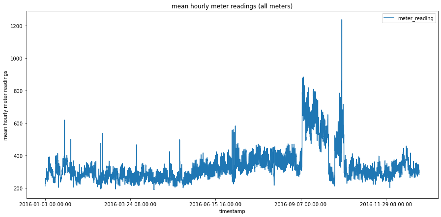
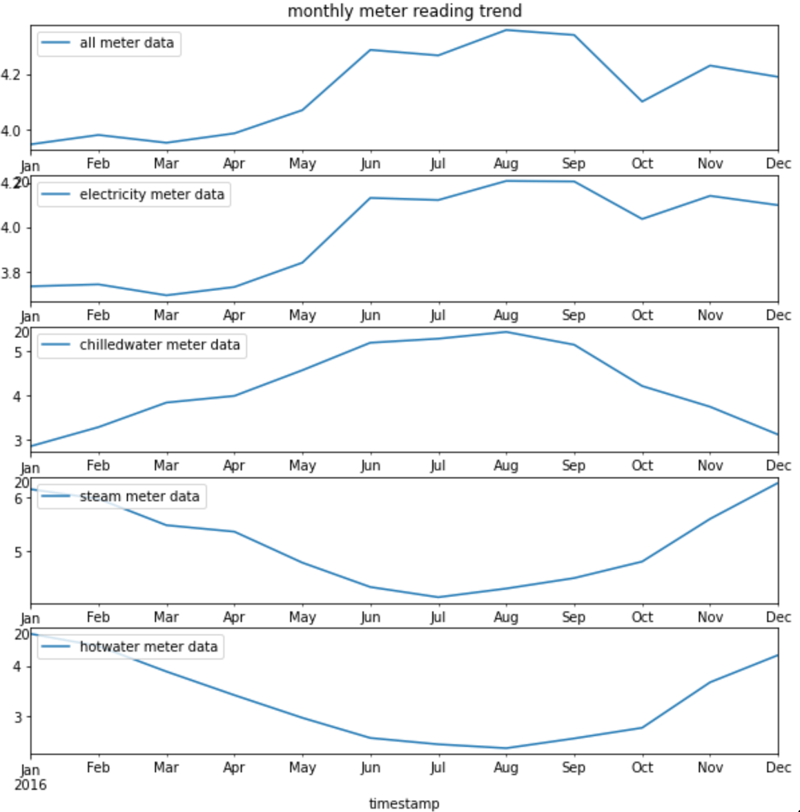
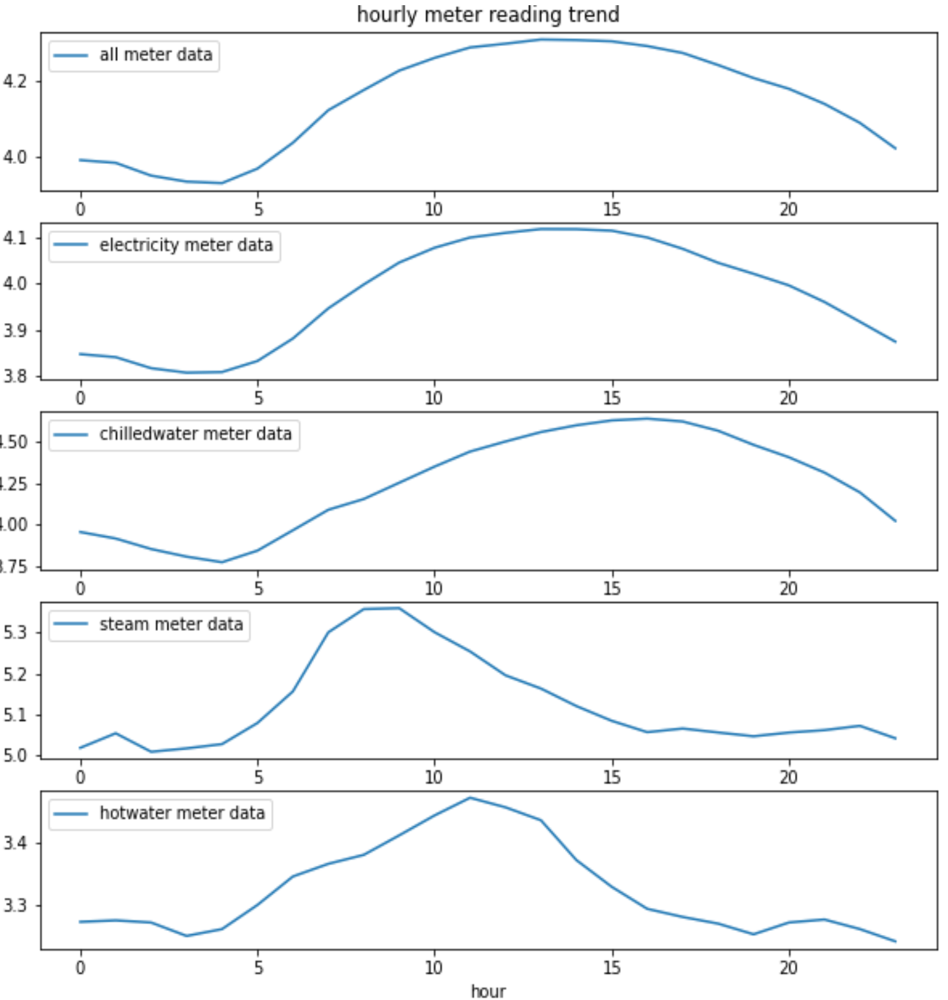

## Methods
### Exploratory Data Analysis
Five data files are provided in the competition dataset. The file names and the contents of each file are detailed below (adapted from the [competition site](https://www.kaggle.com/c/ashrae-energy-prediction/data)).

**train.csv**<br>
- `building_id` - Foreign key for the building metadata.<br>
- `meter` - The meter id code. Read as {0: electricity, 1: chilledwater, 2: steam, 3: hotwater}. Not every building has all meter types.<br>
- `timestamp` - When the measurement was taken.<br>
- `meter_reading` - The target variable. Energy consumption in kWh (or equivalent, except site 0 electric meter readings which are in kBTU). Note that this is real data with measurement error, which may impose a baseline level of modeling error. <br>

**building_meta.csv**<br>
- `site_id` - Foreign key for the weather files.<br>
- `building_id` - Foreign key for training.csv<br>
- `primary_use` - Indicator of the primary category of activities for the building based on EnergyStar property type definitions<br>
- `square_feet` - Gross floor area of the building<br>
- `year_built` - Year building was opened<br>
- `floor_count` - Number of floors of the building<br>

**weather_[train/test].csv** <br>
Weather data from a meteorological station as close as possible to the site.<br>
- `site_id`<br>
- `air_temperature` - Degrees Celsius<br>
- `cloud_coverage` - Portion of the sky covered in clouds, in oktas<br>
- `dew_temperature` - Degrees Celsius<br>
- `precip_depth_1_hr` - Millimeters<br>
- `sea_level_pressure` - Millibar/hectopascals<br>
- `wind_direction` - Compass direction (0-360)<br>
- `wind_speed` - Meters per second<br>

**test.csv** <br>
The submission files use row numbers for ID codes in order to save space on the file uploads. test.csv has no feature data; it exists to help get predictions into the correct order.<br>
- `row_id` - Row id for your submission file<br>
- `building_id` - Building id code<br>
- `meter` - The meter id code<br>
- `timestamp` - Timestamps for the test data period<br>

**sample_submission.csv** <br>
A valid sample submission containing `row_id` to match your predictions.<br>

All floats in the solution file were truncated to four decimal places. There are gaps in some of the meter readings for both the train and test sets. Gaps in the test set are not revealed or scored.

#### Missing values
Here are the number (percentage) of missing values in each dataframes:<br>
1. Missing data in bldg_meta: <br>
    - primary_use: 	0 (0.0%)<br>
    - year_built: 	774 (53.4%)<br>
    - square_feet: 	0 (0.0%)<br>
    - floor_count: 	1094 (75.5%) <br>
2. Missing data in weather_train:<br>
    - air_temperature: 	55 (0.0%)<br>
    - cloud_coverage: 	69173 (49.5%)<br>
    - dew_temperature: 	113 (0.1%)<br>
    - precip_depth_1_hr: 	50289 (36.0%)<br>
    - sea_level_pressure: 	10618 (7.6%)<br>
    - wind_direction: 	6268 (4.5%)<br>
    - wind_speed: 	304 (0.2%) <br>
3. Missing data in weather_test:<br>
    - air_temperature: 	104 (0.0%)<br>
    - cloud_coverage: 	140448 (50.7%)<br>
    - dew_temperature: 	327 (0.1%)<br>
    - precip_depth_1_hr: 	95588 (34.5%)<br>
    - sea_level_pressure: 	21265 (7.7%)<br>
    - wind_direction: 	12370 (4.5%)<br>
    - wind_speed: 	460 (0.2%)<br>

As we can see, some features such as `year_built`, `floor_count` and `air_temperature`, are missing over half of all entries. Special attention should be given to these variables when filling in the missing values to avoid losing raw training data while minimizing artificial influence.

#### Building Metadata
There are in total 16 sites, labeled 0~15 (`site_id`), containing 1449 buildings. Each building is identified with a unique `building_id` independent from the `site_id`, from 0 to 1448. The number of buildings in each site differ greatly, as shown in Figure {@fig:image4}.

{#fig:image4}

There are 16 primary use types, with a mix of residential and commercial buildings, mostly built after the 1950s. Both the building square footage and floor counts are approximately logarithmically distributed, meaning most buildings are relatively small, single- to multi-story buildings (Figure {@fig:image5}). There's a fairly strong correlation (correlation coefficient = 0.53) between building square footage and floor counts, as we could expect, and a small but positive correlation between the constructed year and the building size (0.11). 

{#fig:image5}

#### Target Variable: Meter Readings

When analyzing the meter readings, it was discovered that some measurements were suspiciously high. After analyzing each meter type, It was found that meter 2 (steam) was responsible for the unusually high values. After this discovery, each site was analyzed, and the data anomaly was located to site 13. Figure {@fig:image6} shows the mean hourly steam readings for site 13. Figure {@fig:image7} shows all meter readings for all sites. Lastly Figure {@fig:image8} illustrates all meter readings when site 13 was removed. It is clear that the readings are much larger in the first two graphs. Also, the shape of the graph is dictated by site 13.

{#fig:image6}

{#fig:image7}

{#fig:image8}

Since meter reading is time series data, it is helpful to study the predominant frequency in the data. The following figures show how the meter_reading change in different month of a year and in different hours during a day. 

{#fig:image9}

{#fig:image10}

Figure {@fig:image9} and {@fig:image10} indicate the meter reading changes significantly during different months and different hours in a day, which makes `month_in_a_year`, and `hour_in_a_day` potentially good date-time features.

#### Weather Data
`weather_train` has 2016 hourly weather data, and `weather_test` has 2017~18 hourly weather data. The time series plots for all variables of both the training and test periods are shown below (Figure {@fig:image11}).

{#fig:image11}

#### Correlations
Putting `building_metadata`, `train` and `weather_train` together, we can generate the correlation between each features and the target variable. The heat map below (Figure {@fig:image12}) shows that the correlation between variables range from -0.32 to 0.98, but no individual features have significant correlation with the target variable `meter_reading`. The top 5 most features most correlated with `meter_reading` are building square footage (0.13), number of floors (0.13), year of construction (0.11), meter type (0.077), and sites (0.047). This suggests that building metadata are potentially important predictors for our machine learning models, and the missing values need to be treated with care.

In addition, some features show rather strong correlations with each other, such as: `square_feet` and `floor_count` (0.58); `air_temperature` and `dew_temperature` (0.75); `wind_direction` and `wind_speed` (0.43). This may provide insights to imputation of the missing values.

{#fig:image12}

### Machine Learning Models
#### Baseline: Linear Regression
This section will cover how a linear regression model was constructed in order to predict household energy consumption, as well as discuss the limitations of a linear model. 

**Training data preprocessing**<br>
As it has been described earlier in this section sections, the data used for this Kaggle competition came in three different files: train data, building metadata and weather train data. Since the dataset contains over 20 million readings and numerous features, issues with RAM usage had to be dealt with. The main problem was that not all desirable features could be included in the before RAM usage hit the limit. It was crucial to identify the most predictive features and not include meaningless features which would increase unneccesary RAM usage. In addition to that, a memory saving function was utilized, which changed the data types to be less memory demanding. Lastly, the three datasets were loaded with only the desired columns, to further reduce unneccesary RAM usage.

**Linear regression model**<br>
The linear regression model was created by adding a feature layer with all the desired numerical and categorical features and then adding a dense layer for linear regression. First, missing values in a column were replaced with the mean of that column. In order to create a feature layer, the features used for the prediction had to be converted to tensors. Lastly, categorical features had to be one-hot encoded before being added to the feature layer.

The best public score (RMSLE) that could be obtained with this linear model was 4.5 (4.24 private score).

#### Neural Network: Recurrent Neural Network with Long Short Term Memory (RNN-LSTM)
**Choossing the Model**<br>
This dataset is in its essense a time-series dataset, which is what RNN is designed at handling. LSTM is one of the most effective and commonly used RNN that improves on RNN's diminishing gradient problem. The advantage of using RNN-LSTM is that instead of using engineer features to account for the time information, the model architecture inherently carries this info and learns the relationship between each timestep, reducing the number of features needed. 

**Training Data Preprocessing**<br>
*Building Metadata*<br>
We first treated the building meta data as it is used in both training and testing. `year_built` and `floor_count` were the two features containing missing data. Since one site likely has buildings built around the same time, we used the average `year_built` in one site to impute the missing values. Similarly, same `primary_use` may mean buildings have similar number of floors, so we used the average `floor_count` of one `primary_use` to impute the missing floor counts.

*Weather Data*<br>
For `weather_train`, we noticed that there were missing entries in the `weather_train` dataframe, i.e. for some hours in the training data there were not a single weather variable record. Since NaN values cannot be handled by RNN, we first found the missing hours and filled them in as rows in `weather_train`.

We then imputed the missing data in `weather_train`. Since most of the weather variables have clear seasonalities/follows a annual cycle, for each weather variable, we imputed the missing data with the average of the rest of the data in the respective month. 

*Categorical Column: `primary_use`*<br>
One-hot encoding was first tried for the 16 primary use types, but it created very sparse data (i.e. every one-hot category column only has a small fraction of ones) and quickly consumed all memory. We then chose to use the label encoder from sklearn to convert the categories into integers.

The three dataframes were then merged together to form the training dataframe, with data types modified to conserve RAM.

**Creating Training Data Tensors**<br>
For RNN, training tensors need to have the following shape:
    `[number of samples, number of timesteps, number of features]`

Each sample needs to have the same shape. However, not every building has record for the whole of 2016. To handle this, we used the same truncating technique as in Class 12, with three major modifications:<br>
1. **Each sample is a building-meter pair**: this is to solve the problem that not every building has all meter types, and to conform the number of timesteps;<br>
2. **Setting a cleaning threshold (`THRES`)**: buildings with number of meter_readings < `THRES` will be discarded;<br>
3. **The start of record time period is truncated**: instead of truncating the time steps exceeding THRES from the end, I decided to truncate the start, because as observed in EDA, many sites have near-zero meter readings at the start of the training period, which likely is not generalizable and hence should be discarded.<br>

**Transforming Target Variable Space**<br>
Because we have many heteorogenous feature varaibles having values of different orders of magnitude, we would like to use a normalization layer in our model architecture to transform the data into having zero means and unit standard deviations. If we could also transform the target variable, projecting the values onto a closer space to the training data, that would help the model converge faster.

We chose the `numpy.log1p()` transformation, which is taking natural log on the all target values plus one. This way, zero meter readings can also be handled without generating negative infinity, and the transformed data have the same order of magnitude as all feature variables. Moreover, unlike normalization/standardization, this transformation is self-contained, meaning we can transform the testing predictions back without relying on the information from the training data.

**RNN Architecture**<br>
The RNN-LSTM is a simple model with one hidden layer.<br>
1. **Normalization layer**: to transform the feature variables;<br>
2. **LSTM layer with return_sequence = True**: This will allow LSTM to generate one output at each time step;<br>
3. **Dense output layer**.<br>
The code block for constructing the model is shown below.

```python
model = tf.keras.Sequential()

norm = tf.keras.layers.experimental.preprocessing.Normalization()
norm.adapt(train_x)

# Add normalization layer
model.add(norm)

# Add RNN: LSTM layer
model.add(
    tf.keras.layers.LSTM(units=32, # units is the number of hidden states
                         input_shape = (None, num_features), # None to allow for flexible prediction length
                         dropout = 0.2, # for regularization
                         return_sequences = True) # So we get a prediction for each time step
         ) 

# Add output layer
model.add(tf.keras.layers.Dense(1)) # because we only want to predict one value at each time step
```
**RNN Training**<br>
Adam optimizer with a learning_rate of 5e-4 is used for an initial training of 30 epochs. Mean Squared Error losses are monitored with early stopping. It took about 30-45 minutes to finish training.

```python
model.compile(optimizer=tf.keras.optimizers.Adam(learning_rate=5e-4),
              loss='mse',
              metrics=[tf.keras.metrics.RootMeanSquaredError()])

model.fit(train_ds.shuffle(50).batch(10), 
          epochs=30, 
          callbacks=tf.keras.callbacks.EarlyStopping(monitor='loss', patience=3))
```

**RNN Tuning**<br>
*Two-step learning rate schedule*<br>
After 30 epochs, we lowered the learning rate to 1e-4 and continued training 30 more epochs. This two-step manual learning rate scheduling seemed to generate better performance than using a constant learning rate, as after the intial training the decreasing trend for losses slowed down and plateaued near the end of the initial training, which likely suggested that model learning was at capacity.

*Hyperparamter Tuning and Other Adjustments*<br>
We attempted to improve the model performance by adjusting the following elements of the model:
* Model architecture: whether to have dropout or not at the LSTM layer;
* `THRES` value: a higher threshold means less samples but more training time steps, and vice versa. 
* Hyperparameters: such as learning rate, number of epochs and number of samples to shuffle.

Table {@tbl: table1} below summarizes the changes we made for three of the submissions, as well as the scores. Note the score for the competition is Root Mean Squared Logarithmic Error (RMSLE) as defined by the competition.

Table 1: Summary of key adjustments made for three submissions using RNN-LSTM. {#tbl:table1}
| Submission | Model Architecture  | `THRES` | Learning Rate                                     | Shuffle, Batch | EarlyStopping | Scores (Training, Testing) |
|------------|---------------------|-----------------------------------|---------------------------------------------------|----------------|---------------|----------------------------|
| 1          | LSTM w/o dropout    | 7,000                             | 1e-3 for 14/15 epochs, then 1e-4 for 10/20 epochs | 20, 10         | patience=3    | 1.696. 1.708               |
| 2          | LSTM w/o dropout    | 8,000                             | 5e-4 for 25/25 epochs, then 1e-4 for 25/25 epochs | 50, 10         | patience=3    | 1.696, 1.681               |
| 3          | LSTM w. dropout=0.2 | 8,000                             | 5e-4 for 30/30 epochs, then 1e-4 for 30/30 epochs | 100, 10        | patience=3    | 1.651, 1.623               |
<br>

Changes from 1 to 2 were mainly to test the effect of THRES, and 2 to 3 to test the effect of dropout. Learning rate schedules etc. were also adjusted based on observations from other unsubmitted tries. 

**Applying RNN to Test Data**<br>
Since we constructed traing dataset by seperating samples based on building_id and meter type, we also needed to do predictions accordingly, looping through each building and each of its meters (see code block below). We could not compile testing data into a single array because 1) it caused too much memory overhead; and 2) each building would have different length of time for predictions.

The prediction results were first converted back into the original data space (by taking exponential and subtracting 1), then stored to the corresponding rows in the newly added `meter_reading` column in the original `test` dataframe. Using the original `test` dataframe is necessary to match predictions to the submission file with `row_id`, as required by the competition. It took ~35 minutes to finish the test.

```python
test['meter_reading'] = np.zeros(test.shape[0], dtype=np.float32)

for bldg_id in test_full.building_id.unique():
    bldg = test_full[test_full.building_id==bldg_id]
    print(str(bldg_id)+', ', end='')
    for m in bldg.meter.unique():
        met = bldg[bldg.meter==m]
        # adding a dim=1 at axis=0 to match the input layer shape
        ts = np.expand_dims(met[feat_cols].values, axis=0) 
        del met
        v = np.float32(np.expm1(model.predict(ts).squeeze()))
        del ts
        test.loc[(test.building_id==bldg_id)&(test.meter==m), 'meter_reading'] = v
        del v
    del bldg
```


#### Tree-based Model: Light Gradient Boosting Machine (LGBM)

**Introduction to LGBM**<br>

LightGBM is an abbreviation for Light Gradient Boosting Machine, a free open source gradient enhancement framework for machine learning.It is an ensemble model of decision trees which are trained in sequence.1.Each tree will be built based on the previous tree’s error. Finally, predictions will be made by the sum of all of those trees. And errors are minimised by using the gradient method.

Following is the advantage of the LightGBM:

First of all, LGBM is a faster training algorithm compared to other tree-based algorithms. For example, its histogram-based splitting. Finding the exact optimal split is very costly when the dataset is large, since it involves testing every possible split point. By using a histogram-based (quantile-based) solution, the splitting procedure is much faster.
 
Secondly, Similarly to the histogram-based algorithm, the continuous variables are replaced with discrete bins which largely reduce the memory usage.
 
Thirdly, lgbm is good at dealing with categorical data. For instance, fisher method is a very excellent LGBM method. In fact, the Fisher method, also known as Fisher's combined feasibility test, is a data fuse or "meta-analysis" technique. Developed and named by Ronald Fisher. It is used as the basis for combining the results of several independent tests based on a common hypothesis. Instead of one-hot encoding, which significantly increases the size of the dataset, fisher’s method is used to find the optimal split of categorical variables, which means none of the encoding method is needed. 
 
Last but not least, lgbm is good at dealing with large dataset.
 
However, the LightGBM still have some disadvantages. The main disadvantage of lgbm is it is sensitive to overfitting. And methods such as regularizations, and controlling the number of leaves can be used to address this problem.

**LightGBM model #1: predicting meter_reading by meter type**<br>

**Data Preprocessing**<br>
The general data preprocessing is similar to the 'Training Data Preprocessing' section in RNN-LSTM. Thus, this section will only discuss the differences of the data preparation between LGBM and RNN-LSTM.

**Engineered Date-Time Features**<br>
Meter_reading is time series data, and extracting the data-time features is necessary in order to treat time series forecasting as a supervised learning problem. In this model, 'Month of a year', 'Day of a month', 'Day of a week', and 'Hour in a day' are the engineered time-related features. To better extract the time features, Fast Fourier Transformation can be used to reveal the predominant frequency of time series data. Lag features can also be further added since the meter_reading  might be related to the weather variables at previous timestamps.

**Features in LGBM**<br>
After feature selection, the following features are included in the LGBM model: 'square_feet' 'year_built', 'floor_count','air_temperature', 'cloud_coverage', 'dew_temperature', 'building_id', 'site_id','primary_use','dayofweek','meter','hour','day','month'. Among these features, 'building_id', 'site_id', 'primary_use', and the four engineered time features are taken as categorical variables.

**NaN values**<br>
As shown in the EDA, the percentage of missing values are relatively high in  'year_built', 'floor_count', 'cloud_coverage', 'air_temperature', and 'dew_temperature'. The methods used to deal with the missing values can result in very different results in the model. The missing values in these columns are dealt in different ways. 

For 'cloud_coverage', 'air_temperature', and 'dew_temperature', a missing value is filled with the mean by averaging the values from the same day of the same month at the same site . This is because weather related variables change over site, month, and the day in a month. For 'floor_count', the mean value of the floor_count column is used to fill in the missing values. For 'year_built', the missing values remain without further operation. LGBM will ignore missing values during a split, then allocate them to whichever side reduces the loss the most.

**Preparing the dataset for the model**<br>
There are four meter types in the project. Thus, four models are built for the four meter types seperately in order to tune the hypeparameters for each meter type. The training and testing datasets are seperately for the model of meter type 0, 1, 2, and 3 accordingly.

```python
def create_x_y(train_df, target_meter):
    target_train_df = train_df[train_df['meter'] == target_meter]
    train_x = target_train_df[feature_columns]
    train_y = target_train_df['log_meter_reading'].values

    del target_train_df
    return train_x, train_y
train_x0, train_y0 = create_x_y(train_all, target_meter=0)
train_x1, train_y1 = create_x_y(train_all, target_meter=1)
train_x2, train_y2 = create_x_y(train_all, target_meter=2)
train_x3, train_y3 = create_x_y(train_all, target_meter=3)
```

**LGBM Model Structure**<br>
```python
def fit_models(train_df,target_meter,folds=2,seed=None,shuffle=False, num_rounds=1500,lr=0.1,bf=0.1,l2=0.2, nl = 30):
    kfold = KFold(n_splits=folds, shuffle = shuffle, random_state = seed)
    train_x, train_y = create_x_y(train_df, target_meter)
    
    categoricals = [train_x.columns.get_loc(c_col) for c_col in categorical_feacture]
    
    models = []
    
    for train_idx, val_idx in kfold.split(train_x,train_y):
        xtrain = train_x.iloc[train_idx,:]
        xval = train_x.iloc[val_idx,:]
        ytrain = train_y[train_idx]
        yval = train_y[val_idx]

        params = {'boosting_type': 'gbdt',
                  'objective': 'regression',
                  'metric': {'rmse'}, 
                  'bagging_freq': 5, 
                  'bagging_fraction': bf, 
                  'learning_rate': lr, 
                  'num_leaves': nl, 
                  'feature_fraction': 0.9, 
                  'lambda_l2': l2  
        }
        
        early_stopping_condition = 30 
        verbose_evaluation = 20 
        
        lgb_train_ds = lgbm.Dataset(xtrain, label = ytrain, categorical_feature = categoricals)
        lgb_val_ds = lgbm.Dataset(xval, label = yval, categorical_feature = categoricals)
        
        model = lgbm.train(params,
                           train_set = lgb_train_ds,
                           num_boost_round = num_rounds,
                           valid_sets = (lgb_train_ds, lgb_val_ds),
                           early_stopping_rounds = early_stopping_condition,
                           verbose_eval = verbose_evaluation)
        
        models.append(model)
    return models
```

The model is built into the function fit_models to apply the same model four times.

**K-fold Validation**<br>
K-fold validation is built into the model to estimate the model's performance before applying the model to the test data. The number of folds is initialized with 2, and will be updated in model fitting. With the number of folds equal to k, the dataset will be split into k groups. Each group will be taken as a hold out, and the mdoel trained on the other groups will be tested on the leave-out group.

**Train the Model for Each Meter Type**<br>
```python
models_0 = fit_models(train_all,target_meter=0,folds=5,num_rounds = 1000, lr = 0.1,bf = 0.7,l2 = 0.2,nl = 50)
models_1 = fit_models(train_all,target_meter=1,folds=5,num_rounds = 1000, lr = 0.1,bf = 0.7,l2 = 0.2,nl = 50)
models_2 = fit_models(train_all,target_meter=2,folds=5,num_rounds = 1000, lr = 0.1,bf = 0.7,l2 = 0.2, nl = 50)
models_3 = fit_models(train_all,target_meter=3,folds=5,num_rounds = 1000, lr = 0.1,bf = 0.7,l2 = 0.2, nl = 50)
```
**LGBM Tunning**<br>
LGBM is sensitive to overfitting, and thus, several ways were taken to aviod overfitting.
1. k-fold validation: If the RMSE of the model on the training groups is decreasing, and the RMSE of the model on the validation group is not changing significantly with iterations, there might be overfitting probelm.
2. set up early_stopping_condition: The model will stop training if the validation metric is not improving after the last early stopping round. If the early_stopping_round is set to be too large, the change of overfitting increases.
3. lambda_l1 and lambda_l2: Avoiding overfitting uses regularizations.
4. num_leaves: By setting up the maximum number of leaves of a tree, overfitting can be controlled.

Table {@tbl:table2} below shows the overfitting issue while the `num_leaves` increasing:

Table 2: `num_leaves` and the resulted test scores. {#tbl:table2}
| `num_leaves` for model of meter 0~3 | Test score  | 
|----------------------|--------------|
| 50, 50, 50, 50           | 1.154  |
| 100, 150, 150, 100       | 1.157  |
| 100,200,200,150          | 1.163|

The test score (RMLSE) increases when the `num_leaves` increses, which indicates overfitting. Thus, num_leaves=50 is used for each model.

**Predicting on Test Data**<br>
```python
def create_predictions(test_set, models, batch_size):
    i = 0
    ret = []
    for j in range(int(np.ceil(test_set.shape[0] / batch_size))):
        ret.append(np.expm1(sum([model.predict(test_set.iloc[i:i+batch_size]) for model in models]) / len(models)))
        i += batch_size
    return ret

def generate_results(test_df, target_meter, models,batch_size = 1):
    test_x = create_x(test_df,target_meter)
    gc.collect()

    test_y = create_predictions(test_x,models,batch_size)
    return test_y

test_y_0 = generate_results(test_all,target_meter = 0, models = models_0, batch_size = 100000)
test_y_1 = generate_results(test_all,target_meter = 1, models = models_1, batch_size = 100000)
test_y_2 = generate_results(test_all,target_meter = 2, models = models_2, batch_size = 100000)
test_y_3 = generate_results(test_all,target_meter = 3, models = models_3, batch_size = 100000)
```
Since the log(meter_reading) is used in the model training, the np.expm1() in the function 'create_predictions' transfer the predictions to the original values. np.concatenate() is used to combine the predictions from the four models.

The histograms of 'meter_reading' can indicate the accuracy of the models. For each meter type, if the histograms of the meter_reading from the training data and the prediction are similar, then the model is reasonable. Histograms of meter_type=0 is provided below as an example (Figure {@fig:image13}).

{#fig:image13 Left:training Right:prediction}

**LightGBM model #2: predicting meter_reading in one model**<br>
In 'LightGBM model #1', we built one model for each meter type, while in 'LightGBM model #2' one model was constructed to predict the meter reading for all meter types, with meter_type as a categorical feature. The structure and code for this model is very similar to LightGBM model #1 so they are omitted here. This model allows us to compare the feature importance for all features. Figure {@fig:image14} shows the feature importance in 'LightGBM model #2'.

{#fig:image14}

From Figure {@fig:image14}, 'meter_type' is the fourth most important feature, thus, it is reasonable to build a seperated model for each meter type, and doing so did improve the model performance. The test scores for LGBM model #1 and #2 are summarized in Table {@tbl:table3} below.

Table 3: Test scores for LGBM model #1 and #2. {#tbl:table3}
| LGBM model | Test score  | 
|----------------------|--------------|
| #1 (one model for each meter type)    | 1.15  |
| #2 (one model for all meter types) |  1.37 |
