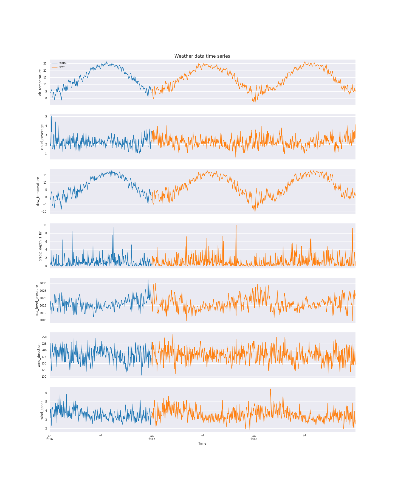

## Methods
### Exploratory Data Analysis
ADD GENERAL DESCRIPTION OF THE DATASET AND FILES HERE.
#### Missing values

#### Building Metadata
There are in total 16 sites, labeled 0~15 (`site_id`), containing 1449 buildings. Each building is identified with a unique `building_id` independent from the `site_id`, from 0 to 1448. The number of buildings in each site differ greatly, as shown in {@fig:image2}.

{#fig:image2}

There are 16 primary use types, with a mix of residential and commercial buildings, mostly built after the 1950s. Both the building square footage and floor counts are approximately logarithmically distributed, meaning most buildings are relatively small, single- to multi-story buildings ({@fig:image3}). There's a fairly strong correlation (correlation coefficient = 0.53) between building square footage and floor counts, as we could expect, and a small but positive correlation between the constructed year and the building size (0.11). 

{#fig:image3}

#### Target Variable: Meter Readings
ASSIGNED TO: Mingyu

#### Weather Data
`weather_train` has 2016 hourly weather data, and `weather_test` has 2017~18 hourly weather data. The time series plots for all variables of both the training and test periods are shown below ({@fig:image4})

{#fig:image4}

#### Correlations

### Machine Learning Models
#### Baseline: Linear Regression

#### Neural Network: RNN-LSTM

#### Tree-based Model: LightGBM

