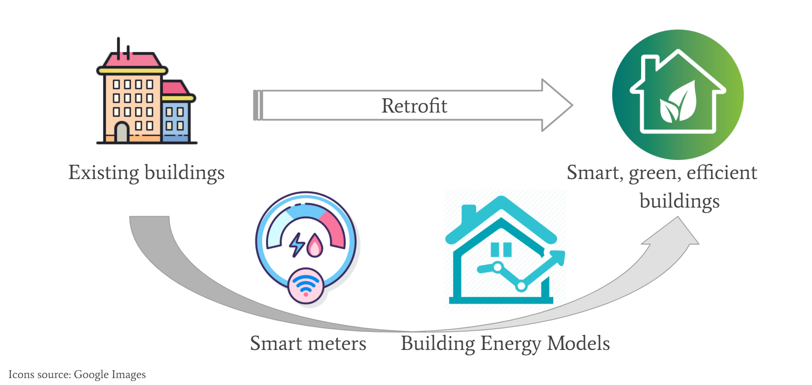
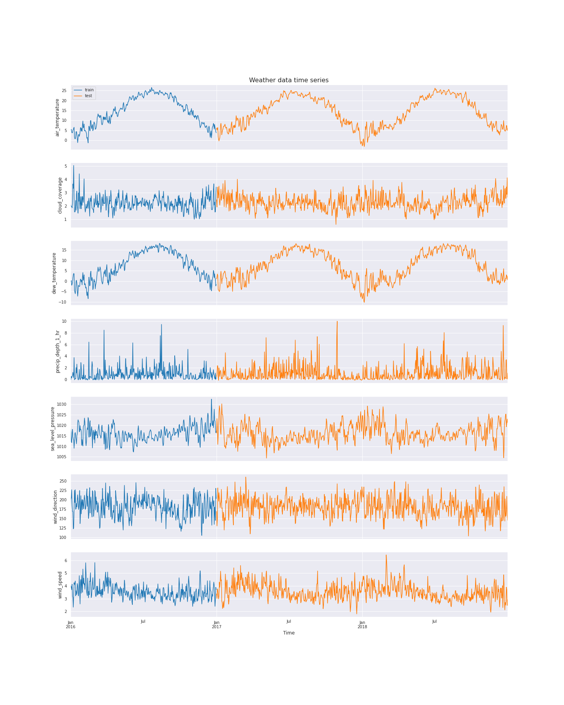

---
author-meta:
- Xinchang 'Cathy' Li
- Benjamin Smakic
- Zhiyi Yang
- Mingyu Sun
bibliography:
- content/manual-references.json
date-meta: '2020-12-06'
header-includes: '<!--

  Manubot generated metadata rendered from header-includes-template.html.

  Suggest improvements at https://github.com/manubot/manubot/blob/master/manubot/process/header-includes-template.html

  -->

  <meta name="dc.format" content="text/html" />

  <meta name="dc.title" content="CEE 498DS Project 11: Building Energy Predictions - Project Report" />

  <meta name="citation_title" content="CEE 498DS Project 11: Building Energy Predictions - Project Report" />

  <meta property="og:title" content="CEE 498DS Project 11: Building Energy Predictions - Project Report" />

  <meta property="twitter:title" content="CEE 498DS Project 11: Building Energy Predictions - Project Report" />

  <meta name="dc.date" content="2020-12-06" />

  <meta name="citation_publication_date" content="2020-12-06" />

  <meta name="dc.language" content="en-US" />

  <meta name="citation_language" content="en-US" />

  <meta name="dc.relation.ispartof" content="Manubot" />

  <meta name="dc.publisher" content="Manubot" />

  <meta name="citation_journal_title" content="Manubot" />

  <meta name="citation_technical_report_institution" content="Manubot" />

  <meta name="citation_author" content="Xinchang &#39;Cathy&#39; Li" />

  <meta name="citation_author_institution" content="Department of Civil and Environmental Engineering, University of Illinois at Urbana-Champaign" />

  <meta name="citation_author" content="Benjamin Smakic" />

  <meta name="citation_author_institution" content="Department of Aeronautical &amp; Vehicle Engineering, Royal Institute of Technology, KTH" />

  <meta name="citation_author_institution" content="Department of Civil and Environmental Engineering, University of Illinois at Urbana-Champaign" />

  <meta name="citation_author" content="Zhiyi Yang" />

  <meta name="citation_author_institution" content="Department of Civil and Environmental Engineering, University of Illinois at Urbana-Champaign" />

  <meta name="citation_author" content="Mingyu Sun" />

  <meta name="citation_author_institution" content="Department of Civil and Environmental Engineering, University of Illinois at Urbana-Champaign" />

  <link rel="canonical" href="https://cathyxinchangli.github.io/cee498ds-project11/" />

  <meta property="og:url" content="https://cathyxinchangli.github.io/cee498ds-project11/" />

  <meta property="twitter:url" content="https://cathyxinchangli.github.io/cee498ds-project11/" />

  <meta name="citation_fulltext_html_url" content="https://cathyxinchangli.github.io/cee498ds-project11/" />

  <meta name="citation_pdf_url" content="https://cathyxinchangli.github.io/cee498ds-project11/manuscript.pdf" />

  <link rel="alternate" type="application/pdf" href="https://cathyxinchangli.github.io/cee498ds-project11/manuscript.pdf" />

  <link rel="alternate" type="text/html" href="https://cathyxinchangli.github.io/cee498ds-project11/v/a666b030067f82afdc16762874cccaf7881ac681/" />

  <meta name="manubot_html_url_versioned" content="https://cathyxinchangli.github.io/cee498ds-project11/v/a666b030067f82afdc16762874cccaf7881ac681/" />

  <meta name="manubot_pdf_url_versioned" content="https://cathyxinchangli.github.io/cee498ds-project11/v/a666b030067f82afdc16762874cccaf7881ac681/manuscript.pdf" />

  <meta property="og:type" content="article" />

  <meta property="twitter:card" content="summary_large_image" />

  <link rel="icon" type="image/png" sizes="192x192" href="https://manubot.org/favicon-192x192.png" />

  <link rel="mask-icon" href="https://manubot.org/safari-pinned-tab.svg" color="#ad1457" />

  <meta name="theme-color" content="#ad1457" />

  <!-- end Manubot generated metadata -->'
keywords:
- (TBD, keeping the originals for now) markdown
- publishing
- manubot
lang: en-US
manubot-clear-requests-cache: false
manubot-output-bibliography: output/references.json
manubot-output-citekeys: output/citations.tsv
manubot-requests-cache-path: ci/cache/requests-cache
title: 'CEE 498DS Project 11: Building Energy Predictions - Project Report'
...


<small><em>
This manuscript
([permalink](https://cathyxinchangli.github.io/cee498ds-project11/v/a666b030067f82afdc16762874cccaf7881ac681/))
was automatically generated
from [cathyxinchangli/cee498ds-project11@a666b03](https://github.com/cathyxinchangli/cee498ds-project11/tree/a666b030067f82afdc16762874cccaf7881ac681)
on December 6, 2020.
</em></small>

## Authors


+ **Xinchang 'Cathy' Li**<br>
    · {.inline_icon}
    [cathyxinchangli](https://github.com/cathyxinchangli)<br>
  <small>
     Department of Civil and Environmental Engineering, University of Illinois at Urbana-Champaign
  </small>

+ **Benjamin Smakic**<br>
    · {.inline_icon}
    [mkbenja](https://github.com/mkbenja)<br>
  <small>
     Department of Aeronautical & Vehicle Engineering, Royal Institute of Technology, KTH; Department of Civil and Environmental Engineering, University of Illinois at Urbana-Champaign
  </small>

+ **Zhiyi Yang**<br>
    · {.inline_icon}
    [zhiyiy2](https://github.com/zhiyiy2)<br>
  <small>
     Department of Civil and Environmental Engineering, University of Illinois at Urbana-Champaign
  </small>

+ **Mingyu Sun**<br>
    · {.inline_icon}
    [mingyu012](https://github.com/mingyu012)<br>
  <small>
     Department of Civil and Environmental Engineering, University of Illinois at Urbana-Champaign
  </small>


## Abstract {.page_break_before}

This is the abstract. Testing to see if it will show up.

Under pay-for-performance financing, the building owner makes payments based on the difference between their real energy consumption and what they would have used without any retrofits. The latter values have to come from a model. Current methods of estimation are fragmented and do not scale well. Some assume a specific meter type or don’t work with different building types.

Therefore, we develop accurate models of metered building energy usage in the following areas: chilled water, electric, hot water, and steam meters. The data comes from over 1,000 buildings over a three-year timeframe. With better estimates of these energy-saving investments, large scale investors and financial institutions will be more inclined to invest in this area to enable progress in building efficiencies.

By utilizing modern electric meters, it possible to collect and store enormous amount of data about household energy consumption. This data can be used to predict energy consumption and help energy providers manage energy (electricity) output and plan for energy peaks/lows.  


## Introduction

By utilizing modern electric meters, it possible to collect and store enormous amount of data about building energy consumption. This data can be used to predict
energy consumption and help energy providers manage energy (electricity) output and plan for energy peaks/lows. It can also help the indiviudal resident keep track
of their energy usage and perhaps even recommend energy saving actions. 

As the human population increases, it is vital to lower the energy footprint of each individual and save the limited resources earth has to offer to future generations.

Household energy consumption is a big part of our total energy consumption, and new technology offers new ways of decreasing it.

This project focuses on predicting building energy consumption based on the Kaggle competition "ASHRAE - Great Energy Predictor III". The main goal of the project is first and foremost to create an AI-model that can predict the energy usage of a building as accurately as possible, based on different input data such as air temperature, building size etc. In addition to that, different AI-models are explored to investigate which one works the best for this particular competition.

{#fig:image1}


## Literature review
### Zhang, Grolinger, & Capretz (2109): Forecasting Residential Energy Consumption: Single Household Perspective
In the paper “Forecasting Residential Energy Consumption: Single Household Perspective”  (Zhang, Grolinger & Capretz 2019), the authors attempt to predict energy consumption in residential households, with focus on single households. 

According to the authors it is more difficult to predict single household energy (electricity) consumption, compared with e.g. workplace energy consumption. The reason is that single households often differ in energy consumption patterns while workplace patters tend to be more similar. Also, if big workplace buildings or multi-family residential buildings are analysed, any anomalies tend to cancel each other out (with a big enough dataset).

#### Data set
The data set used originates from an electricity provider in London, Ontario, Canada. It consists of hourly smart-meter readings of electricity usage (kWh) of 15 households between 2014 and 2016. 

Firstly, the data set used might not be sufficiently broad. Tracking only 15 households will most likely not capture a variety of electricity consumption patterns. However, it was deemed enough in this case. Furthermore, the data set comes from one city with a certain climate, which means that different environmental prerequisites are not considered. Perhaps using other cities from a different part of the world would lay a foundation for a more advanced ML-algorithm (Machine Learning algorithm). As it is now, the ML-algorithm might be inaccurate for other parts of the world.   In addition to this, Zhang, Grolinger & Capretz  state that residents of London, Ontario, Canada tend to heat their homes gas heating systems, which affects the electricity consumption drastically. 

Secondly, the data set used is pre-processed in different ways. Any missing readings of electricity consumption is replaced with the average value of the previous reading and the next reading, missing weather condition is replaced with the weather condition of the previous hour etc. This is perfectly good way of replacing missing data. However, the authors do not give an explanation as to why this method was chosen, if there are any consequences and if there are other methods of making the data set complete. 

#### Exploratory Data Analysis
The EDA performed by the authors is illustrated in the form of electricity consumption graphs and heat-maps. The patterns show that most households live regular lives (the authors do not define what “regular lives” mean, though it can be understood by the context). However, there are some exceptions where irregularities occur (e.g. empty homes during the summer when consumption otherwise is the highest), which significantly reduce the precision. This could be improved by adding vacancy detection which could be implemented in the ML-algorithm (which raise privacy concerns).  Zhang, Grolinger & Capretz realize that the top three most important variables (i.e. the variables that correlate the most with the output energy consumption) are “temperature”, “hour of the day” and “peak index”. Peak index is a variable that captures important energy usage peaks, such as peak hours, days, seasons etc. 

#### Prediction model and results
The authors used Support Vector Regression (SVR) to predict the energy consumption. SVR is a supervised machine learning algorithm, which means that it is compares an input with an output and is trained by comparing predicted results with true results.  It was chosen due to time and computational hardware constraints. No other evaluations or comparison of other machine learning algorithms were made by the authors, so it is difficult to understand why SVM is faster and require less processing power. 
Zhang, Grolinger & Capretz present the results for home #1 in figure 1. They managed to predict electricity consumption well. The most inaccurate parts are peaks that arise due to random variations. Furthermore, the authors present a table with results for all 15 homes. According to them, time-based splitting is used to check parameter stability over time, which makes the algorithm more accurate. In this case however random sampling performs better in cases where some residential customers have irregular and uncertain patterns. These uncertain patterns make time-based splitting more inaccurate over time. Therefore, both methods are employed. Lastly, mean absolute percentage of error (MAPE) was utilized to measure the performance of the algorithm, which is a widely used performance metric.
 
Figure 1: Observed electricity consumption compared to predicted electricity consumption for house #1 (of 15) (Zhang et al.). 
Insert figure
Figure 2: Performance results of the predication model for all homes.
Insert figure
#### Conclusion
The biggest strength of the paper is the execution of the chosen methods to achieve desired results. It is a relatively successful attempt at predicting single households, which tend to be more unpredictable compared to multi-family or corporate residential buildings. The biggest weakness is the justification for the chosen methods. The authors do an excellent job of utilizing the chosen methods, but there is little thought put in to why these methods where chosen or why they did certain things. By including a more extensive evaluation and justification for method choices, the target audience and other researchers in the same field can understand better and continue the research. However, it makes the paper longer and more complex, which can be negative for the readers and the target audience. 

### Edwards, New, & Parker (2012): Predicting future hourly residential electrical consumption: A machine learning case study
The article explores seven machine learning (ML) techniques on their performances in predicting next hour electricity consumption of buildings, with a focus on residential buildings. Sensor-based energy modeling uses high-frequency sensor data and ML algorithms to statistically derive building energy forecasting models that can help improve building efficiency. Previous studies have applied such models to commercial buildings where high-frequency sensor data are available, but not to residential buildings due to a lack of sensors in homes and consequently a lack of frequent sensor data. The authors address this gap by employing a new high-frequency residential dataset to test proven and emerging ML techniques on predicting next hour residential energy consumptions. The ML techniques used include: Linear Regression, Feed Forward Neural Networks (FFNN), Support Vector Regression (SVR), Least Squares Support Vector Machines (LS-SVM), Hierarchical Mixture of Experts (HME) with Linear Regression Experts, HME with FFNN Experts, and Fuzzy C-Means with FFNN. They use cross validation for parameter tuning, and select the best model based on three performance metrics, namely Coefficient of Variance (CV), Mean Bias Error (MBE) and Mean Absolute Percentage of Error (MAPE). 

The authors first validate the ML techniques on the ASHRAE Great Energy Predictor Shootout dataset, which contains hourly sensor data for a commercial building of year 1989. They find that FFNN performs best on this dataset, with CV at ~11%, competitive with the top-3 competition winners. Then they apply these techniques to the new dataset, the Campbell Creek dataset, which contains full-year (2010) measurements at 15-minute interval from sensors installed on three Tennessee homes. The results show unsatisfactory results from FFNN (CV = ~32%), close to the baseline Linear Regression (CV = ~34%). LS-SVM is selected as the overall best technique for modeling the Campbell houses, with an average CV of ~26%. The overall larger model errors in the residential dataset are attributed to variant occupancy behaviors in homes that lead to more complex energy use patterns, as compared to those of commercial buildings, which tend to vary only between workdays and weekends/holidays. The also find that statistically different training and testing data may cause LS-SVM to fail when generalizing to the testing data, which is the case for the ASHRAE dataset. The performance of LS-SVM is improved after randomizing the training and testing data. 

This paper provides a comprehensive analysis on the application of multiple ML techniques to building energy data, which could serve as a guide to our project. The discussions on the differences between commercial and residential buildings are particularly helpful for our feature engineering and model selection, as we are expected to model 16 building types, commercial and residential included. The authors are also able to identify and prove the cause of failure for LS-SVM on the ASHRAE dataset, which may help us in model tuning and selection. Despite these merits, the paper does not address the differences in performance for FFNN, HME-FFNN and FCM-FFNN, the three closely related methods, shedding doubts on whether it is necessary to include them all. In addition, it would be very informative if the paper included the computational expenses required for training each model, which could be an important metric in model selection especially for real-life applications.

### Ferrarini, L., Fathi, E., Disegna, S., & Rastegarpour, S. (2019). Energy consumption models for residential buildings: A case study.
This article mainly discusses the advantages and disadvantages of four different energy consumption models for residential buildings based on a real building in the north part of Italy. These four energy consumption models are Black-box and scenario definition model, Gray-box model, White-box (Energy Plus) model and Tuned Energy Plus model respectively.

Due to the fact that the energy consumption is affected by multiple kind of factors such as the building material, light, temperature and so on. Different data sources are needed in this analysis. Therefore, the data that this paper use to analyze is mainly from three different kind of sensors which are temperature sensor, heat cost allocator and heat meter respectively. What’s more, the meteorological data is also be considered in these models. The data was collected every 15 minutes and the whole collecting process lasted for seven months.

In the main body of this paper, it introduces the different modeling approaches of these four energy consumption models and use all of them to calculate the yearly and monthly energy consumption. After that, three important indexes are introduced to compare the four models which are error, error% and NRMSE% respectively. The index of error is used to evaluate the monthly consumption, while the indexes of error% and NRMSE% are used to evaluate the yearly consumption This paper subtracts measured energy consumption from the estimated energy consumption to ger error and it divides error by measured energy consumption to get error%. In addition, it calculates the NRMSE% with a complex mathematical formula with the value of error and error%.

According to the figure 1 shown in the article (2019), we can tell that the model of black-box 1 has the smallest error, which means it is the most accurate model among these models both on a monthly and annual basis. The reason for its accuracy is that it uses more direct measurement data in the modeling process, unlike other models that convert part of the measurement data into other parameters before using it.

In addition, although compared to Black-box model, the tuned Energy Plus model does not have that high accuracy rate, but its performance in the annual forecast fully meets industry requirements according to the Ferrarini's summary (2019).

In conclusion, at the end of the article, the author summarized the four models and affirmed the practicality of black-box and tuned Energy Plus model once again. 


## Methods
### Exploratory Data Analysis
Five data files are provided in the competition dataset. The file names and the contents of each file are detailed below (adapted from the [competition site](https://www.kaggle.com/c/ashrae-energy-prediction/data)).

**train.csv**
* `building_id` - Foreign key for the building metadata.
* `meter` - The meter id code. Read as {0: electricity, 1: chilledwater, 2: steam, 3: hotwater}. Not every building has all meter types.
* `timestamp` - When the measurement was taken
* `meter_reading` - The target variable. Energy consumption in kWh (or equivalent, except site 0 electric meter readings which are in kBTU). Note that this is real data with measurement error, which may impose a baseline level of modeling error. 

**building_meta.csv**
* `site_id` - Foreign key for the weather files.
* `building_id` - Foreign key for training.csv
* `primary_use` - Indicator of the primary category of activities for the building based on EnergyStar property type definitions
* `square_feet` - Gross floor area of the building
* `year_built` - Year building was opened
* `floor_count` - Number of floors of the building

**weather_[train/test].csv** <br>
Weather data from a meteorological station as close as possible to the site.
* `site_id`
* `air_temperature` - Degrees Celsius
* `cloud_coverage` - Portion of the sky covered in clouds, in oktas
* `dew_temperature` - Degrees Celsius
* `precip_depth_1_hr` - Millimeters
* `sea_level_pressure` - Millibar/hectopascals
* `wind_direction` - Compass direction (0-360)
* `wind_speed` - Meters per second

**test.csv** <br>
The submission files use row numbers for ID codes in order to save space on the file uploads. test.csv has no feature data; it exists to help get predictions into the correct order.

* `row_id` - Row id for your submission file
* `building_id` - Building id code
* `meter` - The meter id code
* `timestamp` - Timestamps for the test data period

**sample_submission.csv** <br>
A valid sample submission containing `row_id` to match your predictions.

All floats in the solution file were truncated to four decimal places. There are gaps in some of the meter readings for both the train and test sets. Gaps in the test set are not revealed or scored.

#### Missing values
Here are the number (percentage) of missing values in each dataframes:
1. **Missing data in bldg_meta**: <br>
    * primary_use: 	0 (0.0%)<br>
    * year_built: 	774 (53.4%)<br>
    * square_feet: 	0 (0.0%)<br>
    * floor_count: 	1094 (75.5%) <br>
2. **Missing data in weather_train**:<br>
    * air_temperature: 	55 (0.0%)<br>
    * cloud_coverage: 	69173 (49.5%)<br>
    * dew_temperature: 	113 (0.1%)<br>
    * precip_depth_1_hr: 	50289 (36.0%)<br>
    * sea_level_pressure: 	10618 (7.6%)<br>
    * wind_direction: 	6268 (4.5%)<br>
    * wind_speed: 	304 (0.2%) <br>
3. **Missing data in weather_test**:<br>
    * air_temperature: 	104 (0.0%)<br>
    * cloud_coverage: 	140448 (50.7%)<br>
    * dew_temperature: 	327 (0.1%)<br>
    * precip_depth_1_hr: 	95588 (34.5%)<br>
    * sea_level_pressure: 	21265 (7.7%)<br>
    * wind_direction: 	12370 (4.5%)<br>
    * wind_speed: 	460 (0.2%)<br>

As we can see, some features such as `year_built`, `floor_count` and `air_temperature`, are missing over half of all entries. Special attention should be given to these variables when filling in the missing values to avoid losing raw training data while minimizing artificial influence.

#### Building Metadata
There are in total 16 sites, labeled 0~15 (`site_id`), containing 1449 buildings. Each building is identified with a unique `building_id` independent from the `site_id`, from 0 to 1448. The number of buildings in each site differ greatly, as shown in {@fig:image2}.

{#fig:image2}

There are 16 primary use types, with a mix of residential and commercial buildings, mostly built after the 1950s. Both the building square footage and floor counts are approximately logarithmically distributed, meaning most buildings are relatively small, single- to multi-story buildings ({@fig:image3}). There's a fairly strong correlation (correlation coefficient = 0.53) between building square footage and floor counts, as we could expect, and a small but positive correlation between the constructed year and the building size (0.11). 

{#fig:image3}

#### Target Variable: Meter Readings
ASSIGNED TO: Mingyu

#### Weather Data
`weather_train` has 2016 hourly weather data, and `weather_test` has 2017~18 hourly weather data. The time series plots for all variables of both the training and test periods are shown below ({@fig:image4}).

{#fig:image4}

#### Correlations
Putting `building_metadata`, `train` and `weather_train` together, we can generate the correlation between each features and the target variable. The heat map below ({@fig:image5}) shows that the correlation between variables range from -0.32 to 0.98, but no individual features have significant correlation with the target variable `meter_reading`. The top 5 most features most correlated with `meter_reading` are building square footage (0.13), number of floors (0.13), year of construction (0.11), meter type (0.077), and sites (0.047). This suggests that building metadata are potentially important predictors for our machine learning models, and the missing values need to be treated with care.

In addition, some features show rather strong correlations with each other, such as: `square_feet` and `floor_count` (0.58); `air_temperature` and `dew_temperature` (0.75); `wind_direction` and `wind_speed` (0.43). This may provide insights to imputation of the missing values.

{#fig:image5}

### Machine Learning Models
#### Baseline: Linear Regression
ASSIGNED TO: Benjamin

#### Neural Network: Recurrent Neural Network with Long Short Term Memory (RNN-LSTM)
**Choossing the Model**<br>
This dataset is in its essense a time-series dataset, which is what RNN is designed at handling. LSTM is one of the most effective and commonly used RNN that improves on RNN's diminishing gradient problem. The advantage of using RNN-LSTM is that instead of using engineer features to account for the time information, the model architecture inherently carries this info and learns the relationship between each timestep, reducing the number of features needed. 

**Training Data Preprocessing**<br>
*Building Metadata*<br>
We first treated the building meta data as it is used in both training and testing. `year_built` and `floor_count` were the two features containing missing data. Since one site likely has buildings built around the same time, we used the average `year_built` in one site to impute the missing values. Similarly, same `primary_use` may mean buildings have similar number of floors, so we used the average `floor_count` of one `primary_use` to impute the missing floor counts.

*Weather Data*<br>
For `weather_train`, we noticed that there were missing entries in the `weather_train` dataframe, i.e. for some hours in the training data there were not a single weather variable record. Since NaN values cannot be handled by RNN, we first found the missing hours and filled them in as rows in `weather_train`.

We then imputed the missing data in `weather_train`. Since most of the weather variables have clear seasonalities/follows a annual cycle, for each weather variable, we imputed the missing data with the average of the rest of the data in the respective month. 

*Categorical Column: `primary_use`*<br>
One-hot encoding was first tried for the 16 primary use types, but it created very sparse data (i.e. every one-hot category column only has a small fraction of ones) and quickly consumed all memory. We then chose to use the label encoder from sklearn to convert the categories into integers.

The three dataframes were then merged together to form the training dataframe, with data types modified to conserve RAM.

**Creating Training Data Tensors**<br>
For RNN, training tensors need to have the following shape:
    `[number of samples, number of timesteps, number of features]`

Each sample needs to have the same shape. However, not every building has record for the whole of 2016. To handle this, we used the same truncating technique as in Class 12, with three major modifications:<br>
1. **Each sample is a building-meter pair**: this is to solve the problem that not every building has all meter types, and to conform the number of timesteps;<br>
2. **Setting a cleaning threshold (`THRES`)**: buildings with number of meter_readings < `THRES` will be discarded;<br>
3. **The start of record time period is truncated**: instead of truncating the time steps exceeding THRES from the end, I decided to truncate the start, because as observed in EDA, many sites have near-zero meter readings at the start of the training period, which likely is not generalizable and hence should be discarded.<br>

**Transforming Target Variable Space**<br>
Because we have many heteorogenous feature varaibles having values of different orders of magnitude, we would like to use a normalization layer in our model architecture to transform the data into having zero means and unit standard deviations. If we could also transform the target variable, projecting the values onto a closer space to the training data, that would help the model converge faster.

We chose the `numpy.log1p()` transformation, which is taking natural log on the all target values plus one. This way, zero meter readings can also be handled without generating negative infinity, and the transformed data have the same order of magnitude as all feature variables. Moreover, unlike normalization/standardization, this transformation is self-contained, meaning we can transform the testing predictions back without relying on the information from the training data.

**RNN Architecture**<br>
The RNN-LSTM is a simple model with one hidden layer.<br>
1. **Normalization layer**: to transform the feature variables;<br>
2. **LSTM layer with return_sequence = True**: This will allow LSTM to generate one output at each time step;<br>
3. **Dense output layer**.<br>
The code block for constructing the model is shown below.

```python
model = tf.keras.Sequential()

norm = tf.keras.layers.experimental.preprocessing.Normalization()
norm.adapt(train_x)

# Add normalization layer
model.add(norm)

# Add RNN: LSTM layer
model.add(
    tf.keras.layers.LSTM(units=32, # units is the number of hidden states
                         input_shape = (None, num_features), # None to allow for flexible prediction length
                         dropout = 0.2, # for regularization
                         return_sequences = True) # So we get a prediction for each time step
         ) 

# Add output layer
model.add(tf.keras.layers.Dense(1)) # because we only want to predict one value at each time step
```
**RNN Training**<br>
Adam optimizer with a learning_rate of 5e-4 is used for an initial training of 30 epochs. Mean Squared Error losses are monitored with early stopping. It took about 30-45 minutes to finish training.

```python
model.compile(optimizer=tf.keras.optimizers.Adam(learning_rate=5e-4),
              loss='mse',
              metrics=[tf.keras.metrics.RootMeanSquaredError()])

model.fit(train_ds.shuffle(50).batch(10), 
          epochs=30, 
          callbacks=tf.keras.callbacks.EarlyStopping(monitor='loss', patience=3))
```

**RNN Tuning**<br>
*Two-step learning rate schedule*<br>
After 30 epochs, we lowered the learning rate to 1e-4 and continued training 30 more epochs. This two-step manual learning rate scheduling seemed to generate better performance than using a constant learning rate, as after the intial training the decreasing trend for losses slowed down and plateaued near the end of the initial training, which likely suggested that model learning was at capacity.

*Hyperparamter Tuning and Other Adjustments*<br>
We attempted to improve the model performance by adjusting the following elements of the model:
* Model architecture: whether to have dropout or not at the LSTM layer;
* `THRES` value: a higher threshold means less samples but more training time steps, and vice versa. 
* Hyperparameters: such as learning rate, number of epochs and number of samples to shuffle.

The following table summarizes the changes we made for three of the submissions, as well as the scores. Note the score for the competition is Root Mean Squared Logarithmic Error (RMSLE) as defined by the competition.

| Submission | Model Architecture  | `THRES` | Learning Rate                                     | Shuffle, Batch | EarlyStopping | Scores (Training, Testing) |
|------------|---------------------|-----------------------------------|---------------------------------------------------|----------------|---------------|----------------------------|
| 1          | LSTM w/o dropout    | 7,000                             | 1e-3 for 14/15 epochs, then 1e-4 for 10/20 epochs | 20, 10         | patience=3    | 1.696. 1.708               |
| 2          | LSTM w/o dropout    | 8,000                             | 5e-4 for 25/25 epochs, then 1e-4 for 25/25 epochs | 50, 10         | patience=3    | 1.696, 1.681               |
| 3          | LSTM w. dropout=0.2 | 8,000                             | 5e-4 for 30/30 epochs, then 1e-4 for 30/30 epochs | 100, 10        | patience=3    | 1.651, 1.623               |
<br>

Changes from 1 to 2 were mainly to test the effect of THRES, and 2 to 3 to test the effect of dropout. Learning rate schedules etc. were also adjusted based on observations from other unsubmitted tries. 

**Applying RNN to Test Data**<br>
Since we constructed traing dataset by seperating samples based on building_id and meter type, we also needed to do predictions accordingly, looping through each building and each of its meters (see code block below). We could not compile testing data into a single array because 1) it caused too much memory overhead; and 2) each building would have different length of time for predictions.

The prediction results were first converted back into the original data space (by taking exponential and subtracting 1), then stored to the corresponding rows in the newly added `meter_reading` column in the original `test` dataframe. Using the original `test` dataframe is necessary to match predictions to the submission file with `row_id`, as required by the competition. It took ~35 minutes to finish the test.

```python
test['meter_reading'] = np.zeros(test.shape[0], dtype=np.float32)

for bldg_id in test_full.building_id.unique():
    bldg = test_full[test_full.building_id==bldg_id]
    print(str(bldg_id)+', ', end='')
    for m in bldg.meter.unique():
        met = bldg[bldg.meter==m]
        # adding a dim=1 at axis=0 to match the input layer shape
        ts = np.expand_dims(met[feat_cols].values, axis=0) 
        del met
        v = np.float32(np.expm1(model.predict(ts).squeeze()))
        del ts
        test.loc[(test.building_id==bldg_id)&(test.meter==m), 'meter_reading'] = v
        del v
    del bldg
```


#### Tree-based Model: LightGBM

Here is some text.


## Discussion
### The performance of the RNN-LSTM model
The simple LSTM model was fairly effective, largely outperforming the baseline linear regression model but slightly underperforming than the lightgbm models. 
Tuning attempted improved the performance marginally but steadily. Other tuning opportunities we hope to explore if we had more time include: 
excluding some correlated features; 
increasing model complexity by adding one or more layers; 
other ways of handling missing data. 

It is hard to say for certain whether with more tuning, this three-layer RNN-LSTM would outperform our LightGBM models, but our best guess is no. 
The trade-off between number of samples and number of timestamps means we are forced to leave behind part of the information from the raw data
in training. This can potentially be viewed as a shortcoming for RNN-LSTM (or rather our way of handling it).


### Tree-based Model and Neural Networks
ASSIGNED TO: Minyu & Zhiyi


### Challenges
The most significant challenge has been combating the limited memory resources. 
A significant amount of time was spent on optimizing the memory usage; 
which is also helpful as that potentially has also improved the speed of training/predicting, 
and in the long run building foundations for dealing with larger data and more complex problems and models in the future. 

Another challenge was data preprocessing. 


## References {.page_break_before}

<!-- Explicitly insert bibliography here -->
<div id="refs"></div>
